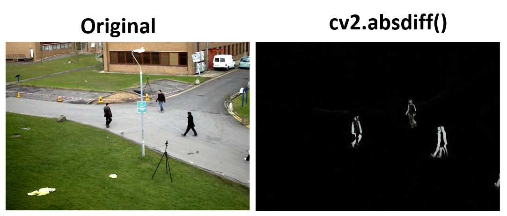
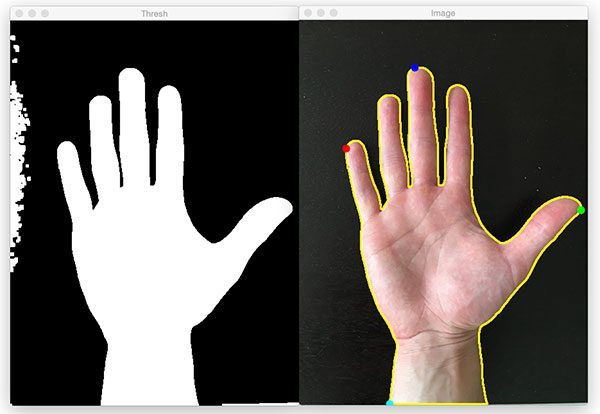

# OpenCV Motion Detection Camera

## Overview
This Python script implements a motion detection system using OpenCV. It captures video from a camera, compares frames with a reference image, and saves snapshots when motion is detected.


## Features
- Real-time camera feed
- Motion detection using frame comparison
- Automatic snapshot saving
- Configurable sensitivity and interval
- Easy exit functionality

## Prerequisites
- Python 3.7+
- OpenCV
- NumPy

## Installation

1. Clone the repository:
```bash
git clone https://github.com/yourusername/motion-detection-camera.git
cd motion-detection-camera
```

2. Install dependencies:
```bash
pip install -r requirements.txt
```

## Preparation
1. Prepare a reference image:
   - This should be a static background image of the area you're monitoring
   - Place the image in the project directory
   - Recommended to match the camera's perspective and lighting conditions

## Configuration
In the script, you can modify these parameters:
- `reference_image_path`: Path to your reference image
- `output_dir`: Directory to save snapshots (default: 'snapshots')
- `threshold`: Motion sensitivity (default: 30)
- `interval`: Time between snapshot checks (default: 5 seconds)

## Usage
```bash
python motion_detection.py
```

## How It Works
1. Loads a reference background image
2. Captures frames from the camera
3. Converts frames to grayscale
4. Compares current frame with reference image
5. Detects motion using image difference and thresholding
6. Saves snapshots when motion is detected

## Troubleshooting
- Ensure camera is not in use by another application
- Check camera permissions
- Adjust `threshold` if too sensitive or not detecting motion
- Verify reference image quality and perspective

## Limitations
- Works best with static cameras
- Sensitive to lighting changes
- May require fine-tuning for specific environments

## Dependencies
- OpenCV
